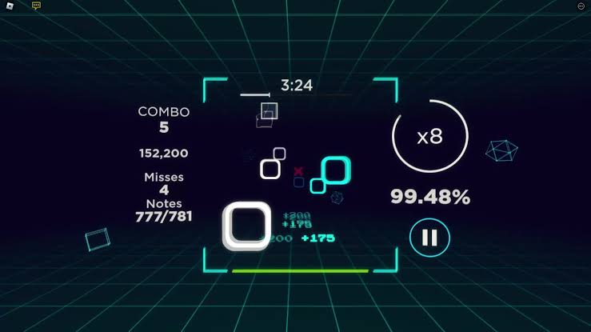

# Sound Space – JavaFX Remake

A desktop remake of the Roblox rhythm game **Sound Space**, built with JavaFX.



## How to Play

Notes fly toward a central square. Move your mouse to position the cursor so it
overlaps each note as it arrives. Hit notes to build combos and earn score
multipliers; miss too many and you fail the song.

## Features

- **4 built-in songs** with Easy and Hard difficulty maps
- **Custom song import** — click "Import Song" to load any WAV or MP3 file
  - Beat detection runs automatically using a spectral-flux onset algorithm
    (inspired by [Essentia's RhythmExtractor2013](https://essentia.upf.edu/tutorial_rhythm_beatdetection.html))
  - Imported songs are saved to `custom_songs/` and persist across runs
  - MP3 files are auto-converted to WAV via ffmpeg (if installed)
- **Sound-Space-accurate UI** — corner bracket borders, multiplier ring,
  combo/accuracy HUD, health bar, cyan/pink alternating notes with glow

## Requirements

- **Java 17+** (tested on OpenJDK 21)
- **JavaFX SDK** (11 or later — download from [openjfx.io](https://openjfx.io))
- **ffmpeg** (optional, needed for MP3 → WAV conversion during custom song import)

## Project Structure

```
src/main/java/soundspace/
  ├── SoundSpaceApp.java      – Application entry point, scenes, HUD, import UI
  ├── Config.java             – Constants, colours, sizing
  ├── BeatMap.java            – Built-in beat-timing arrays + custom song registry
  ├── BeatDetector.java       – Spectral-flux onset detection (FFT-based)
  ├── CustomSongManager.java  – Import, save, and load custom songs (.beats files)
  ├── GameState.java          – Score, combo, accuracy, health tracking
  └── StrokeTransition.java   – Custom colour-fade animation
```

## Building & Running

### Quick build (no build tool)

```bash
# Set JFX to wherever your JavaFX SDK lives
export JFX=/path/to/javafx-sdk/lib

javac --module-path $JFX \
      --add-modules javafx.controls,javafx.media,javafx.graphics \
      -d out \
      src/main/java/soundspace/*.java

java --module-path $JFX \
     --add-modules javafx.controls,javafx.media,javafx.graphics \
     -cp out \
     soundspace.SoundSpaceApp
```

## Audio Files (built-in songs)

Place these in the `src/` directory next to the project root:

| File             | Purpose          |
|------------------|------------------|
| `menu_full.mp3`  | Menu background  |
| `ThisLove.mp3`   | Song – This Love |
| `Engineer.mp3`   | Song – Engineer  |
| `Gangsta.mp3`    | Song – Gangsta   |
| `hit.wav`        | Hit sound effect |
| `miss.wav`       | Miss sound effect|
| `new_best.wav`   | End-screen jingle|

## Custom Songs

1. Click **"＋ IMPORT SONG"** on the menu screen
2. Select a `.wav` or `.mp3` file
3. Beat detection runs automatically — the song appears in the dropdown
4. Imported songs are saved in `custom_songs/` and load automatically next time

### How beat detection works

The `BeatDetector` implements spectral-flux onset detection:
1. Audio is decoded to mono 16-bit PCM
2. Windowed into 1024-sample frames with 512-sample hop
3. FFT magnitude spectrum computed per frame (Cooley–Tukey radix-2)
4. Spectral flux = sum of positive magnitude differences vs. previous frame
5. Adaptive thresholding picks peaks above 1.4× the local mean
6. Minimum 120ms gap between beats prevents double-triggers

This is the same general approach as Essentia's `BeatTrackerMultiFeature`,
adapted to run in pure Java with no external dependencies.

## Credits

- Original game: **Sound Space** by Sound Space Studio (Roblox)
- Beat detection algorithm inspired by [Essentia](https://essentia.upf.edu/)
- Remake by: **Keithley**

## License

This project is provided for educational purposes.
